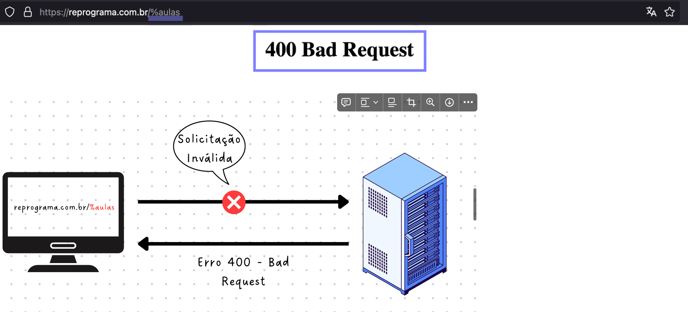
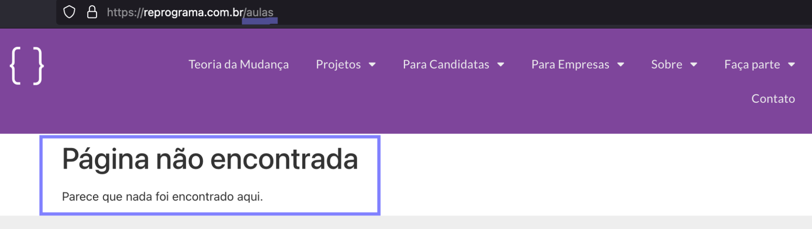
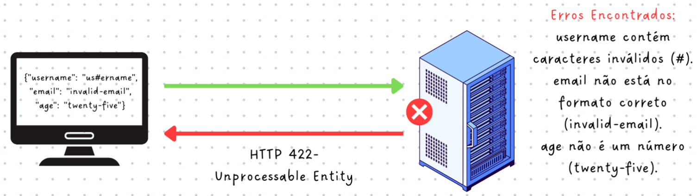
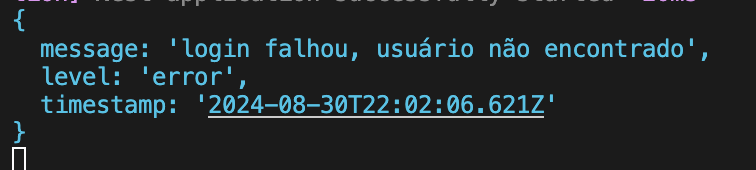
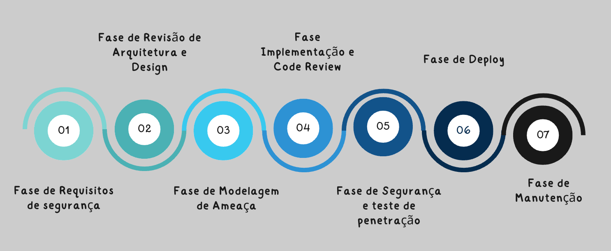
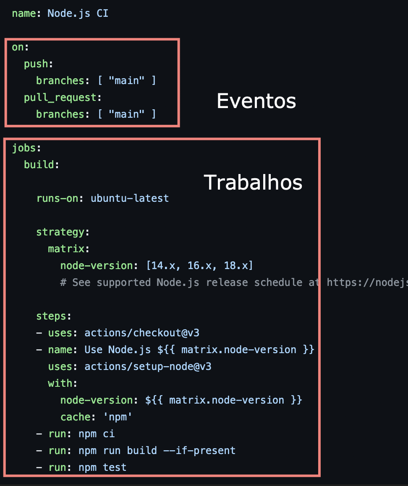
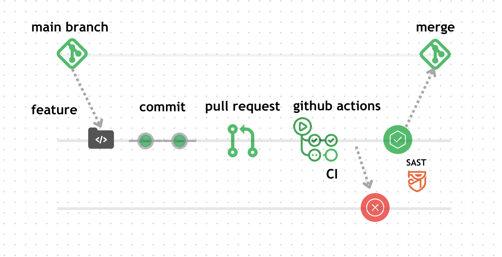
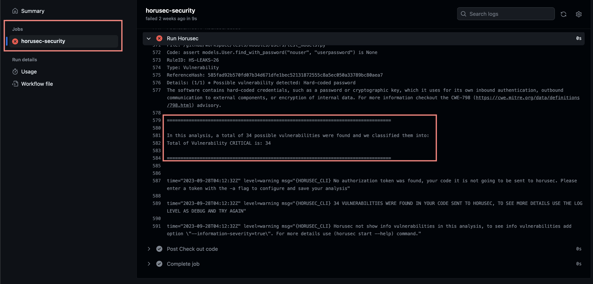

<h1 align="center">
  
</h1>

# Gestão de erros

Turma Online XX - Imersão JavaScript | Semana XX | 20XX | Professora Rayane Pimentel

### Objetivo

- Breve apresentação do conteúdo e dos objetivos da aula.
- Importância da gestão de erros e segurança em APIs.

### Resumo

O que veremos na aula de hoje?

- [Gestão de erros em APIs](#gestão-de-erros-em-apis)

  - [Introdução](#introdução)

- [Conteúdo](#conteúdo)

  - [Tipos de Erros em APIs](#tipos-de-erros-em-apis)

    - [Erros do cliente](#11-erros-do-cliente)
    - [Erros do servidor](#12-erros-do-servidor)
    - [Erros de validação](#13-erros-de-validação)

  - [Estratégias de Gestão de Erros](#2-estratégias-de-gestão-de-erros)

    - [Padrões de Resposta](#21-padrões-de-respostas)
    - [Middleware de Tratamento de Erro](#22-middleware-de-tratamento-de-erros)
    - [Log de Erros](#23-log-de-erros)
    - [Monitoramento e Alertas](#24-monitoramento-e-alertas)

  - [SSDLC e Práticas de Código Seguro](#3-ssdlc-e-práticas-de-código-seguroß)

    - [SSDLC](#31-ssdlc)
    - [OWASP](#32-owasp)
    - [Boas praticas de segurança para codificação](#33-boas-praticas-de-segurança-para-codificação)

  - [Exercícios](#exercícios)
  - [Material da aula](#material-da-aula)
  - [Links Úteis](#links-úteis)

# Gestão de erros em APIs

## Introdução

Nessa aula iremos ver importância da gestão de erros em APIs e como ela impacta a experiência do usuário, manutenção do código e a segurança da aplicação.

# Conteúdo

# 1. Tipos de Erros em APIs

## 1.1 Erros do cliente:

Erros do lado do cliente ocorrem quando há problemas na requisição feita ao servidor, como requisições malformadas ou falta de autorização para acessar um recurso.

- **HTTP 400** (Bad Request): Indica que a requisição está malformada ou contém dados inválidos.
  - Exemplo: Um usuário envia uma requisição com uma URL contendo caracteres especiais que não são permitidos, ou um payload JSON inválido.



- **HTTP 404**: Ocorre quando o recurso solicitado não é encontrado no servidor.

  - "Erro 404: Pagina não encontrada" quando o usuário digita uma URL incorreta que não existe.

  

- **HTTP 403** (Forbidden): Indica que o usuário não tem permissão para acessar o recurso solicitado, mesmo que esteja autenticado.

  - Exemplo: O servidor entende a requisição, mas o usuário não tem autorização para acessá-la, como tentar acessar uma página restrita.

  

## 1.2 Erros do Servidor:

Erros do lado do servidor acontecem quando há um problema ao processar a requisição do cliente. Geralmente, esses erros indicam falhas no código, no banco de dados ou no próprio servidor.

- **HTTP 500** (Internal Server Error): Indica que o servidor encontrou uma condição inesperada que o impediu de atender a requisição.
  - Exemplo: Ocorre quando há uma exceção não tratada no código, como uma falha ao conectar ao banco de dados.


- **HTTP 503** (Service Unavailable): Ocorre quando o servidor não está disponível para processar a requisição, geralmente por estar em manutenção ou sobrecarregado.

  - Exemplo: Um servidor de banco de dados está offline ou o serviço está temporariamente fora do ar.

- **HTTP 502** (Bad Gateway): Indica que um servidor, atuando como gateway ou proxy, recebeu uma resposta inválida de outro servidor ao tentar atender a requisição.
  - Exemplo: Um serviço intermediário como um load balancer não conseguiu se comunicar com o servidor de aplicação.

## 1.3 Erros de Validação:

Erros de validação ocorrem quando os dados enviados pelo cliente não atendem aos requisitos ou regras definidas pela aplicação.

- **HTTP 422** (Unprocessable Entity): Indica que o servidor entendeu a requisição, mas não conseguiu processá-la porque os dados fornecidos são semanticamente incorretos, mesmo que estejam tecnicamente bem formatados.

  

# 2. Estratégias de Gestão de Erros

Vamos discutir e explorar diferentes abordagens para lidar com erros e problemas que podem ocorrer em uma API. O objetivo é fornecer estratégias e técnicas para detectar, tratar e prevenir erros, garantindo que os problemas sejam rapidamente identificados e resolvidos, minimizando o impacto nos usuários e no negócio.


## 2.1 Padrões de Respostas

Definir padrões claros de resposta para diferentes tipos de erros, incluindo status HTTP, mensagens de erro e estrutura de dados.

### 2.1.1 Uso de Códigos de Status HTTP Corretos

Os códigos de status de resposta HTTP indicam se uma solicitação HTTP específica foi concluída com êxito. As respostas são agrupadas em cinco classes:

- _1xx (Informacional)_: Indica que a solicitação foi recebida e está sendo processada.
- _2xx (Sucesso)_: A solicitação foi bem-sucedida.
- _3xx (Redirecionamento)_: A ação adicional é necessária para completar a solicitação.
- _4xx (Erro do Cliente)_: Problemas com a solicitação do cliente.
- _5xx (Erro do Servidor_): Problemas no processamento da solicitação pelo servidor.

Exemplos Comuns:

    200 OK: Solicitação bem-sucedida.
    404 Not Found: Recurso não encontrado.
    500 Internal Server Error: Erro interno no servidor.

```json
{
  "error": {
    "code": 400,
    "message": "Campo 'nome' é obrigatório"
  }
}
```

#### Boas Práticas

- Evite detalhes desnecessários nas mensagens de erro. Em vez disso, use mensagens de erro genéricas para evitar a exposição de informações sensíveis.

Exemplo do que não fazer:


- Utilize códigos de status de erro adequados. Nunca use um status de sucesso para indicar um erro.

Exemplo de erro não claro:

`Campo é obrigatório`, não indicando ao usuário qual é o campo obrigatório.

```json
{
  "error": {
    "code": 400,
    "message": "Campo é obrigatório"
  }
}
```

Exemplo melhorado:

```json
{
  "error": {
    "code": 400,
    "message": "O campo 'nome' é obrigatório."
  }
}
```
Aqui, a mensagem de erro foi refinada para ser mais clara e específica, indicando exatamente qual campo está faltando.

##### 2.1.2 Estruturação de Mensagens de Erro utilizando RFC 7807

O [RFC 7807](https://datatracker.ietf.org/doc/html/rfc7807) fornece uma maneira padronizada de estruturar mensagens de erro em APIs, promovendo consistência e clareza. Usando essa abordagem, você pode criar respostas de erro que são compreensíveis para clientes e fáceis de depurar.

Principais Requisitos do RFC 7807:

- Utilize códigos de status HTTP adequados, geralmente entre 400 e 500, para representar erros.
- O header `Content-Type` deve ser `application/problem+json` ou `application/problem+xml` se estiver usando XML.

```json
application/problem+json
application/problem+xml
```

#### Estrutura Básica de uma Mensagem de Erro

- **Title**: um breve resumo do tipo de problema.
- **Detail**: uma descrição detalhada do problema.
- **Type**: uma URL que descreve o tipo do problema.
- **Status**: o status HTTP gerado pelo servidor.
- **Instance**: (opcional) um URI exclusivo para o erro específico, apontando para um log ou outra fonte de informação relevante.

Exemplo:

```json
HTTP/1.1 404 Not Found
Content-Type: application/problem+json
Content-Language: en

{
  "type": "https://bookstore.example.com/problems/book-not-found",
  "title": "Book Not Found",
  "status": 404,
  "detail": "The book with ID 12345 could not be found in our database.",
  "instance": "/api/books/12345",
  "custom-field": "Additional information or context here"
}
```

Em alguns casos, uma única solicitação pode resultar em múltiplos erros. O RFC 7807 permite lidar com essas situações através de extensões personalizadas que podem ser adicionadas à mensagem de erro básica. Isso permite fornecer detalhes específicos sobre cada erro ocorrido.

Exemplo de Múltiplos Erros:

```json
HTTP/1.1 400 Bad Request
Content-Type: application/problem+json

{
  "type": "https://example.com/problemas#validacao",
  "title": "Erro de Validação",
  "status": 400,
  "detail": "Um ou mais campos de entrada falharam na validação.",
  "instance": "/api/usuarios",
  "errors": [
    {
      "campo": "username",
      "erro": "Nome de usuário já existente."
    },
    {
      "campo": "email",
      "erro": "Endereço de email inválido."
    }
  ]
}
```
Neste exemplo, a propriedade `errors` é uma extensão personalizada que contém uma lista de objetos, cada um descrevendo um erro específico ocorrido durante o processo de validação. Isso demonstra como o RFC 7807 pode ser utilizado para fornecer respostas detalhadas e informativas em casos de múltiplos erros facilitando a depuração e melhorando a experiência do usuário final.


## 2.2 Middleware de Tratamento de Erros

Implementar middleware para capturar e tratar erros de forma centralizada, convertendo-os em respostas HTTP apropriadas.

**Middleware**

Vocês já pararam para pensar o que acontece no meio do caminho entre uma requisição e a resposta que recebemos em uma aplicação?

Essa camada de controle, que processa as requisições antes de chegarem ao destino final, é o que chamamos de middleware.

- Middlewares são blocos de código que são executados durante o processamento de uma requisição HTTP, `antes` de chegar ao manipulador de rota (controller).
- Eles seguem o padrão de design `Chain of Responsibility`, permitindo que várias operações sejam executadas em sequência.


**O que são Middlewares?**

Os Middlewares são funções que são executadas antes do manipulador de rota e são utilizadas para executar tarefas específicas no ciclo de solicitação. Essas funções podem ser declaradas em uma classe, utilizando o decorador `@Injectable()` e implementadas com a interface `NestMiddleware()`.

A função `use`, que é obrigatória na interface `NestMiddleware()`, tem acesso ao objeto `Request` e `Response`, bem como à função `next()`, que chama a próxima função middleware ou, eventualmente, o manipulador de rota, seguindo o padrão de design `Chain Of Responsibility`.


Uma característica importante dos middlewares é que eles são projetados para lidar exclusivamente com solicitações HTTP. Por isso, têm acesso aos objetos request e response, mas não ao contexto completo da aplicação.

**Usando a Analogia para simplificar**

Imagine que você está em um restaurante:

1. O Pedido (Request): Um cliente faz um pedido ao garçom.
2. Middleware 1 - Garçom: O garçom verifica se o pedido está correto e se o cliente pode fazer aquele pedido (autenticação). Se o pedido estiver errado ou o cliente não tiver permissão, o garçom pode cancelar o pedido (interromper o fluxo). Caso contrário, ele encaminha o pedido para a cozinha.
3. Middleware 2 - Cozinheiro: O cozinheiro recebe o pedido e prepara o prato, verificando se todos os ingredientes estão corretos (validação dos dados). Se algo estiver errado, ele pode pedir uma correção (modificar o request) ou preparar o prato conforme solicitado e passar para a próxima etapa.
4. Middleware 3 - Entrega: Finalmente, o prato é entregue ao cliente. Aqui, o garçom verifica se está tudo certo antes de servir (última modificação antes da resposta final).

Cada etapa do processo representa um middleware. Se em algum ponto houver um problema, o fluxo pode ser interrompido ou corrigido antes de seguir adiante. Se tudo correr bem, o pedido chega ao cliente (manipulador de rota), exatamente como solicitado.


**O que podemos executar dentro dos Middlewares?**

- Modificar o Request ou Response: Alterar cabeçalhos, adicionar dados ou modificar informações antes de enviá-las ao próximo middleware.
- Interromper o fluxo: Finalizar a resposta diretamente, se uma condição for atendida, como retornar um erro de autenticação.
- Executar validações ou autenticações: Verificar tokens de segurança, permissões de usuário, ou validar os dados recebidos.


### 2.2.1 Exceções padrão do NestJS


As exceções são uma forma de indicar que algo `deu errado`. No NestJS, temos exceções padrão que podem ser utilizadas para tratar erros comuns, como erros de solicitação HTTP, erros de validação de dados, etc.

O NestJS fornece várias exceções padrão que podem ser utilizadas em seus projetos. Aqui estão algumas das mais comuns:

* `HttpException`: uma exceção genérica para erros de solicitação HTTP.
* `BadRequestException`: uma exceção para erros de solicitação com parâmetros inválidos(400).
* `NotFoundException`: uma exceção para recursos não encontrados(404).
* `UnauthorizedException`: uma exceção para acesso não autorizado.
* Outras: `ForbiddenException`, `UnauthorizedException`, [etc](https://docs.nestjs.com/exception-filters#built-in-http-exceptions).

### 2.2.2 Filter de Exceções

Às vezes, você precisará criar uma exceção personalizada para tratar um erro específico. Por exemplo, se você estiver trabalhando com uma API de pagamento e quiser tratar erros de pagamento, você pode criar uma exceção personalizada chamada `PaymentException`.

```js
typescript
// payment.exception.ts
import { Injectable } from '@nestjs/common';
import { HttpException, HttpStatus } from '@nestjs/common';

@Injectable()
export class PaymentException extends HttpException {
  constructor(message: string) {
     super(message, HttpStatus.PAYMENT_REQUIRED); // Usando o status HTTP 402 - Payment Required
  }
}
```

Utilizando em uma controller:

```js
import { Controller, Post, Body } from '@nestjs/common';
import { PaymentException } from './payment.exception';

@Controller('payments')
export class PaymentsController {
  @Post()
  processPayment(@Body() paymentDetails: any) {
    // Simulação de uma falha de pagamento
    const paymentSuccessful = false; // Suponha que a transação falhou

    if (!paymentSuccessful) {
      throw new PaymentException('Payment failed due to insufficient funds');
    }

    return { message: 'Payment processed successfully' };
  }
}

```

### 2.2.3 Interceptors

Interceptors são objetos que podem ser utilizados para interceptar solicitações e respostas em tempo real, permitindo que você execute código personalizado antes ou após a execução de um controller ou middleware.

Eles podem ser utilizados para transformar dados de saída, gerenciar erros de forma centralizada, fazer logging, modificar headers de resposta, entre outras funcionalidades.


### 2.3 Log de Erros


O log de erros é um registro detalhado dos erros e exceções que ocorrem na aplicação. Isso permite que você:

* Identifique e resolva problemas rapidamente
* Análise padrões de erros e melhore a segurança do aplicativo
* Realize treinamento de dados para melhorar a previsibilidade e detecção de erros

Para logs de produção, é comum utilizar ferramentas especializadas, como Winston, Logstash, ou serviços na nuvem como Elastic Stack ou Datadog.
Essas ferramentas permitem armazenar logs de maneira centralizada, aplicar filtros, fazer buscas complexas e gerar relatórios detalhados.

Vamos usar de exemplo o `winston`.

*Winston*:

Winston é uma das bibliotecas mais populares para registro de logs, do NestJs.

Para instalar o modulo `winston`, execute o seguinte comando:


```bash
npm install winston nest-winston
```

**Configuração**:


Em nosso arquivo `main.ts`, precisamos importar o modulo `winston` e configurá-lo:


```ts
import { WinstonModule } from 'nest-winston';
import * as winston from 'winston';

@Module({
  imports: [
    WinstonModule.forRoot({
      transports: [
        new winston.transports.Console({
          format: winston.format.combine(
            winston.format.timestamp(),
            winston.format.prettyPrint(),
            winston.format.colorize({ all: true })
          ),
        }),
        new winston.transports.File({ filename: 'logs/error.log', level: 'error' }),
        new winston.transports.File({ filename: 'logs/combined.log' }),
      ],
    }),
  ],
})
export class AppModule {}

```

Nesse exemplo, o `Winston`` foi configurado para registrar logs tanto no console quanto em um arquivo chamado error.log, com um formato de log personalizado que inclui timestamp.

**Tipos de Log**

Winston suporta vários tipos de log, que podem ser configurados da seguinte forma:

| Tipo | Descrição |
| --- | --- |
| **info** | Log de informações |
| **warn** | Log de advertência |
| **error** | Log de erro |
| **debug** | Log de depuração |



[Evite expor informações sensiveis!]


### 2.4 Monitoramento e Alertas

Monitoramento envolve a coleta contínua de métricas e logs da sua aplicação para identificar comportamentos anômalos e problemas de performance.

Alertas permitem que você seja notificado imediatamente quando erros críticos ocorrem, garantindo que problemas sejam resolvidos antes que causem grandes impactos.

Existem várias ferramentas de monitoramento que você pode utilizar, como:

* Prometheus e Grafana para monitorar métricas de desempenho
* ELK Stack (Elasticsearch, Logstash, Kibana) para analisar logs e monitorar o aplicativo
* New Relic para monitorar o desempenho do aplicativo e identificar problemas


# 3. SSDLC e Práticas de Código Seguro

## 3.1 SSDLC

O SSDLC (Secure Software Development Life Cycle) é uma abordagem de desenvolvimento de software que integra práticas de segurança em todas as etapas do ciclo de vida de desenvolvimento. Isso ajuda a garantir que as preocupações com a segurança sejam abordadas desde o início do projeto até a sua manutenção, o conceito Shift Left. 

</br>




**Exemplo: Plataforma Voluntáriados**

Cenário: A Plataforma Voluntáriados é um sistema que permite o cadastro de eventos que precisam de voluntários e o cadastro de pessoas interessadas em participar desses eventos.

O fluxo básico da plataforma é:

    Cadastro do administrador do evento voluntário
    Cadastro do evento voluntário
    Inscrição para o evento voluntário

Agora, vamos aplicar cada etapa do SSDLC a esse cenário:

**1. Requisitos de Segurança**

Nessa fase, a plataforma identifica e define o que precisa ser protegido.

* Classificação de dados: Que tipo de dados serão coletados (e.g., nome, e-mail, senha)? Como serão armazenados e manipulados? Qual o nível de criptografia necessário para proteger esses dados?
* LGPD: A conformidade com a LGPD é essencial. Isso inclui obter o consentimento explícito dos usuários e permitir que eles controlem seus dados.
* Gerenciamento de consentimento: Como os usuários fornecerão consentimento e como o sistema lidará com solicitações para remover ou alterar dados.
* Requisitos de auditoria: Definição dos eventos que devem ser registrados (e.g., tentativas de login, alterações nos eventos).

**2. Revisão de Arquitetura e Design**

Aqui, a plataforma avalia o design do sistema para garantir que ele é seguro por padrão.

* Segurança por design: A arquitetura deve garantir a segurança desde o início, como o isolamento de componentes críticos (e.g., banco de dados).
* Protocolos de segurança: Uso de protocolos seguros para a transmissão de dados (e.g., HTTPS, TLS).
* Controle de acesso em camadas: Implementação de um sistema de autorização robusto (e.g., RBAC ou ABAC) para garantir que apenas usuários autorizados possam acessar certas funcionalidades.
* Ferramentas de segurança na nuvem: Utilização de serviços de nuvem com ferramentas integradas de segurança, como firewalls e monitoramento de integridade.

**3. Modelagem de Ameaça**

Depois que os requisitos de segurança são coletados e o design da arquitetura é finalizado, a plataforma passa a identificar possíveis ameaças e ataques.

* Mapeamento de ameaças: Identificação de possíveis ameaças, como ataques de injeção de SQL, XSS, DDoS, e sequestro de sessão.
* Avaliação de risco: Classificação das ameaças de acordo com sua gravidade e probabilidade, e definição de planos de mitigação ou eliminação de riscos.

**4. Implementação e Revisão de Código**

Durante o desenvolvimento, a equipe segue práticas de segurança para garantir que o código seja seguro.

* Boas práticas de código seguro: Validação de entradas, uso de prepared statements e sanificação de dados.
* Ferramentas de segurança no desenvolvimento: Integração de linters de segurança, verificadores de dependências e ferramentas de análise estática (e.g., SonarQube).
* Revisão de código: Realização de revisões de código focadas na identificação de vulnerabilidades de segurança.

**5. Testes de Segurança e Penetração**

Uma vez implementado o código, são realizados testes para identificar e corrigir vulnerabilidades.

* Testes automatizados e manuais: Execução de testes de segurança automatizados (SAST, DAST) e testes de penetração manuais para explorar potenciais falhas de segurança.
* Testes de segurança contínuos: Integração de testes de segurança contínuos no pipeline de CI/CD.

**6. Implementação**

* Deploy seguro: Garantir que o processo de deploy siga práticas seguras, como a proteção de pipelines de CI/CD e a implementação de controles de acesso ao ambiente de produção.
* Checklist de segurança: Uma checklist de segurança antes do deploy, incluindo a validação de configurações e testes finais.

**7. Manutenção**

Após a implementação, a plataforma deve continuar monitorando e atualizando suas práticas de segurança.

* Monitoramento contínuo: Implementação de monitoramento e logging de segurança para detectar atividades suspeitas.
* Automação de monitoramento: Utilização de sistemas de alerta automático para eventos críticos, integrando-os com ferramentas como SIEM.
* Atualizações e patches: Manutenção contínua da aplicação, com a aplicação de patches de segurança e reavaliação das práticas de segurança.
* Plano de resposta a incidentes: Estabelecer um plano de resposta a incidentes, incluindo notificações e procedimentos de recuperação.


## 3.2 OWASP

O Open Web Application Security Project, ou OWASP, é uma organização sem fins lucrativos com foco em melhorar a segurança de software.

A organização mantém diversos projetos open source. Toda gestão da OWASP é realizada de forma colaborativa e cada projeto apresenta uma abordagem distinta, embora todas estejam alinhados com a segurança web.

**Projetos**

### [OWASP Top 10](https://owasp.org/www-project-top-ten/)


É um relatório com os 10 riscos de segurança mais criticos, encontrados em aplicações web.


### [OWASP ASVS](https://owasp.org/www-project-application-security-verification-standard/) - Padrão de verificação de segurança de aplicativo 


É conjunto de requisitos e controle de segurança necessários ao projetar, desenvolver e testar aplicações web. É um guia para verificar a segurança das aplicações web em diferentes níveis de maturidade, do baixo ao avançado.


### [OWASP Proactive Controls](https://owasp.org/www-project-proactive-controls/)

É uma lista que descrevem as 10 categorias de técnica de defesa e controle. É uma lista de conhecimento prático sobre como desenvolver software seguro. 


### [OWASP Secure Coding Practices](https://owasp.org/www-project-secure-coding-practices-quick-reference-guide/) 

São recomendações sobre práticas de codificacões desde a prevenção de vulnerabilidade comuns até implementação correta de controle de seguranção.

### [OWASP Code Review Guide](https://owasp.org/www-project-code-review-guide/)

É um guia de orientações e técnicas que ajuda a identificar vulnerabilidades e erros de segurança em seu código


### [OWASP Cheat Sheets](https://cheatsheetseries.owasp.org/index.html)

Fornecem dicas rápidas e orientações para resolver problemas de segurança específicos de diferentes tecnologias e linguagens de programação.

### [OWASP API Security Top 10](https://owasp.org/API-Security/editions/2023/en/0x00-header/)


É um relatório com os 10 riscos de segurança mais criticos, encontrados em APIs.


## 3.3 Boas praticas de segurança para codificação

Para criar esse guia usei como base **OWASP Secure Coding Practices** e **OWASP Cheat Sheets**


### A. Segurança de entrada e saída de dados:

#### A.1 → **Validação de entrada de dados**

Sempre valide e sanitize todas as entradas de dados vindas dos usuários ou de fontes externas para prevenir ataques de Injeção de SQL, Cross-Site Scripting (XSS) e outros.

A validação de entrada deve ser aplicada tanto no **nível sintático** quanto **no nível semântico.**

- **A validação sintática** deve reforçar a sintaxe correta dos campos estruturados (por exemplo, SSN, data, símbolo de moeda).
- **A validação semântica** deve reforçar a correção de seus *valores* no contexto de negócios específico (por exemplo, a data de início é anterior à data de término, o preço está dentro do intervalo esperado).


→ Nunca confie de forma alguma na entrada do usuário. <br>
→ Validar e rejeitar as entradas é melhor do que sanitizá-las.

💡 Leia mais:

- [https://cheatsheetseries.owasp.org/cheatsheets/Input_Validation_Cheat_Sheet.htm](https://cheatsheetseries.owasp.org/cheatsheets/Input_Validation_Cheat_Sheet.html)
- [https://owasp.org/www-project-web-security-testing-guide/latest/4-Web_Application_Security_Testing/07-Input_Validation_Testing/README](https://owasp.org/www-project-web-security-testing-guide/latest/4-Web_Application_Security_Testing/07-Input_Validation_Testing/README)
- [https://portswigger.net/burp/documentation/desktop/testing-workflow/input-validation](https://portswigger.net/burp/documentation/desktop/testing-workflow/input-validation)


#### A.2 → **Output encoding**

Sempre valide dados em um sistema confiável(ou seja, o servidor), codifique todos os caracteres, a menos que sejam considerados seguros e sanitize a saída de dados não confiáveis usando comandos do sistema operacional.

A codificação de saída (output encoding) é uma técnica eficaz para prevenir ataques de Cross-Site Scripting (XSS), que é um dos principais tipos de ataques que podem ser prevenidos por meio dessa prática de segurança.

 
 💡 Leia mais: [aqui](https://cheatsheetseries.owasp.org/cheatsheets/Web_Service_Security_Cheat_Sheet.html#output-encoding) e [aqui](https://portswigger.net/web-security/cross-site-scripting/preventing#encode-data-on-output)


### B. Segurança de autenticação e gerenciamento de acesso:

#### B.1 → **Autenticação e Gerenciamento de Credenciais**

A autenticação refere-se à validação das informações fornecidas pelo usuário, como nome de usuário e senha, para garantir que correspondam às credenciais corretas e autorizar o acesso ao sistema.

O gerenciamento de credenciais abrange atividades relacionadas ao armazenamento seguro e à proteção das informações de autenticação dos usuários, como senhas, chaves de acesso ou certificados digitais. Isso envolve a implementação de práticas de segurança, como a criptografia, para evitar o acesso não autorizado a essas informações.

Todas as medidas de autenticação devem ser implementadas em um sistema confiável, o que normalmente é o servidor onde o backend da aplicação está em execução.

- **Use um protocolo de transmissão seguro:**  as senhas devem ser transmitidas por um protocolo seguro, como HTTPS, para evitar a interceptação por invasores.
- **As senhas salt e hash:**  devem ser salted e hashed antes de armazená-las no banco de dados.
- **Armazenar senhas em local seguro:**  As senhas devem ser armazenadas em local seguro com acesso restrito.
- **Monitorar tentativas de senha:**  as organizações devem monitorar senhas com falha para detectar e prevenir ataques de força bruta.


💡 Veja sobre: 

- [Dicas sobre armazenamento de senha](https://cheatsheetseries.owasp.org/cheatsheets/Password_Storage_Cheat_Sheet.html#Use_a_cryptographically_strong_credential-specific_salt)
- [Dicas de autenticação](https://cheatsheetseries.owasp.org/cheatsheets/Authentication_Cheat_Sheet.html)
- [Autenticação e gerenciamento do ciclo de vida](https://pages.nist.gov/800-63-3/sp800-63b.html).


#### B.2 → Gerenciamento de Sessão

O gerenciamento de sessões refere-se ao processo seguro de lidar com várias solicitações de um único usuário ou entidade em um aplicativo ou serviço baseado na web. Durante uma sessão, que consiste em várias solicitações e transações, um usuário é autenticado para acessar o sistema. O gerenciamento de sessões envolve a troca de informações secretas com usuários autenticados, tornando as comunicações de rede criptografadas essenciais para garantir a segurança do processo.

Boas práticas:

- **Definir sinalizadores Secure/HttpOnly em seus cookies**
- **Gerar novos cookies de sessão**
    - Um novo cookie sempre deve ser gerado a cada login do usuário.
    - O cookie também deve expirar se a conta ficar inativa por um longo período de tempo e forçar o usuário a se autenticar novamente.
    - O cookie anterior deve ser destruído imediatamente mesmo que não tenha expirado e nunca reutilizado.
- **Configurar cookies de sessão corretamente**
    - Os tokens de sessão devem ser longos, imprevisíveis e exclusivos.
    - Use o param “expire” para forçar o encerramento periódico da sessão como um maneira de evitar o sequestro de sessão.


💡 Veja sobre: 

- [Dicas de gerenciamento de sessão](https://cheatsheetseries.owasp.org/cheatsheets/Session_Management_Cheat_Sheet.html)


#### B.3 → **Access control**

No contexto das aplicações web, o controle de acesso depende da autenticação e gerenciamento de sessões:

- **A autenticação** identifica o usuário e confirma que ele é quem diz ser.
- **O gerenciamento de sessão** identifica quais solicitações HTTP subsequentes estão sendo feitas por esse mesmo usuário.
- **O controle de acesso** determina se o usuário tem permissão para realizar a ação que está tentando realizar.

Broken Access Control ocorre quando um usuário pode ter acesso e executar ações que não lhe são atribuídas.

Exemplo: temos uma aplicação com dois tipos de usuários, `admin` e `comum`. O usuário `admin` pode excluir e editar qualquer usuário `comum`, enquanto o `comum` só realiza ações na sua própria conta. A falha acontece quando o usuário `comum` tem as mesmas ações do usuário `admin`, resultando em falha de escalação de privilégios.

Boas práticas:

- Princípio do privilégio mínimo
- Negar por padrão
- Validar permissões em todas solicitações
- Princípio de defesa em profundidade
- Evite controle de acesso baseado em funções


💡 Veja sobre: 

- [Broken Access Control](https://owasp.org/Top10/A01_2021-Broken_Access_Control/)
- [Cheat Sheets](https://cheatsheetseries.owasp.org/cheatsheets/Authorization_Cheat_Sheet.html), [PortSwigger](https://portswigger.net/web-security/access-control)
- [Project Proactive Controls c7 enforce access controls](https://owasp.org/www-project-proactive-controls/v3/en/c7-enforce-access-controls)
- [ASVS V4-Access-Control](https://github.com/OWASP/ASVS/blob/master/4.0/en/0x12-V4-Access-Control.md)


### C. **Error handling and logging**

#### C.1 **Error handling**

Verifique se a aplicação não exibe mensagens de erro que contenham dados sensíveis que possam auxiliar um atacante, incluindo ID de sessão, versões de software/framework e informações pessoais. Um dos riscos mais comuns relacionados ao tratamento inadequado de erros é o [Information Disclosure](https://portswigger.net/web-security/information-disclosure), que pode revelar informações confidenciais para usuários não autorizados.

Boas práticas:

- Não divulgue informações confidenciais em respostas de erro, incluindo detalhes do sistema, ID de sessão ou informações de conta
- Implemente mensagens de erro genéricas e use páginas de erro personalizadas

#### C.2 Logging

Logging é essencial para a segurança do código, permitindo aos desenvolvedores monitorar e detectar incidentes de segurança. Práticas adequadas de logging envolvem capturar informações relevantes, como interações do usuário e erros, para análise posterior. Isso ajuda a identificar comportamentos suspeitos e rastrear a causa de erros, facilitando a correção de bugs e a resposta a possíveis ataques. É importante seguir práticas recomendadas, como definir uma estrutura clara de logs e proteger informações confidenciais.

Boas práticas:

- Restrinja o acesso aos logs apenas a usuários autorizados
- Não armazene informações confidenciais em logs, incluindo informações desnecessárias detalhes do sistema, ID de sessão ou senhas
- Use níveis apropriados de logging: Utilize diferentes níveis de logging (como DEBUG, INFO, WARNING, ERROR) para registrar informações com base na sua importância. Isso permite filtrar e priorizar os logs conforme necessário.
- Faça log de exceções


💡 Veja sobre Error handling and logging: 

- [OWASP - Security Logging and Monitoring Failures](https://owasp.org/Top10/A09_2021-Security_Logging_and_Monitoring_Failures/)
- [OWASP Logging Cheat Sheet](https://cheatsheetseries.owasp.org/cheatsheets/Logging_Cheat_Sheet.html)
- [OWASP Error Handling Cheat Sheet](https://cheatsheetseries.owasp.org/cheatsheets/Error_Handling_Cheat_Sheet.html)
- [OWASP ASVS - V7: Error Logging](https://github.com/OWASP/ASVS/blob/master/5.0/en/0x15-V7-Error-Logging.md)


### Ferramentas de segurança na pipeline

Vamos entender alguns conceitos importantes:

**O que é pipeline**

Um pipeline, no contexto do desenvolvimento de software, refere-se a uma série de etapas ou estágios pelos quais as alterações de código passam antes de serem implantadas em produção. Cada estágio no pipeline representa uma tarefa específica, como a construção do código, a execução de testes, a análise de segurança e a implantação em diferentes ambientes.

**O que é Workflow**

Um fluxo de trabalho (workflow) refere-se à sequência de etapas ou tarefas que precisam ser realizadas para concluir um processo ou projeto específico. No desenvolvimento de software, um fluxo de trabalho geralmente inclui tarefas como codificação, teste, revisão e implantação.
Ele é definido a partir de um arquivo YAML dentro da pasta .github/workflows.

**O que é SAST**

SAST (Teste de Segurança Estático) é uma técnica de teste de segurança usada em um pipeline de CI/CD. O SAST analisa o código-fonte em busca de vulnerabilidades conhecidas e práticas inseguras. Esses testes de segurança ajudam a identificar e corrigir problemas de segurança antes que o software seja implantado em produção, garantindo que o aplicativo seja seguro e protegido contra ameaças.

**O que é DAST**

DAST (Dynamic Application Security Testing) é um processo de teste de segurança que examina um aplicativo em execução para encontrar vulnerabilidades e identificar possíveis pontos de entrada para ataques. Ao contrário do SAST (Static Application Security Testing), que analisa o código-fonte em busca de vulnerabilidades, o DAST simula ataques reais, permitindo identificar falhas de segurança que só podem ser detectadas quando o aplicativo está em execução.

**O que é GitHub Actions**
O GitHub Actions ajuda a automatizar tarefas dentro do ciclo de vida de desenvolvimento de software. 

**Entendendo o workflow**

- Eventos: Um evento é uma atividade que aciona um fluxo de trabalho. Por exemplo, sempre que você faz um push ou quando uma solicitação de pull request é feita.

- Trabalhos: Um trabalho é uma unidade de trabalho que precisa ser executada em resposta a um evento. Pode ser uma tarefa simples, como processar um arquivo de dados, ou um processo mais complexo, como executar um fluxo de trabalho completo.




| Elemento     | Descrição                                                                                                                                                    |
|--------------|--------------------------------------------------------------------------------------------------------------------------------------------------------------|
| **Jobs**     | O nome do trabalho, que neste exemplo é "build".                                                                                                             |
| **Runs-on**  | Indica que o trabalho "build" será executado em uma máquina virtual com o sistema operacional Ubuntu mais recente.                                            |
| **Etapas**   | As etapas são as unidades de trabalho individuais dentro de um trabalho. Cada etapa representa uma tarefa específica no processo de construção, teste ou implantação. |
| **Uses**     | Ao usar a palavra-chave "uses" em uma etapa, você pode especificar a ação a ser executada. Exemplo: `uses: actions/checkout@v3`, que clona o repositório do projeto. |
| **Name**     | Usada para atribuir um nome opcional a uma etapa específica, facilitando a identificação e descrição da etapa.                                                |


## SAST no pipeline

Como vimos o SAST analisa o código-fonte. Mas como isso é feito? No exemplo, vamos utilizar o `Horusec` que é um SAST. Para saber mais como instalar o `Horusec`, você pode conferir [aqui](https://github.com/rayanepimentel/InfoSec-iniciante/blob/main/devSecOps/pipeline-sast.md)

O workflow ficará assim:

```yml

name: SecurityPipeline
on:
 push:
   branches: [ "main" ]
 pull_request:
   branches: [ "main" ]


jobs:
 horusec-security:
   name: horusec-security
   runs-on: ubuntu-latest
   steps:
   - name: Check out code
     uses: actions/checkout@v2
     with:
       fetch-depth: 0
     - name: Run Horusec
       id: run_horusec
       uses: fike/horusec-action@v0.2.2
       with:
         arguments: -c=horusec-config.json -p ./
```




- `main`: main é o branch principal da aplicação. É o código estável.
- `feature`: é onde estamos escrevendo nossos códigos
- `commit`: commit das nossas alterações
- `pull request`: estamos enviando uma solicitação para mesclar nossas alterações na `main`
- `github action`: quando criamos PR ou fazemos um push com `github actions` configurado, ele é acionado para executar os fluxos de trabalho definidos.
 - `CI`: Toda vez que ele foi acionado, ele executa o trabalho: clona o projeto, roda todos os testes, gerar o build(arquivos que você precisa para a aplicação rodar) da aplicação. E também no nosso caso, executa o Horusec.
 Ou seja, todas as vezes que fizermos um PR, esse processo garante que código de forma segura possa estar integrado na aplicação principal.
 - `horusec`: O Horusec é uma ferramenta de segurança que analisa o código em busca de vulnerabilidades de segurança.

 No nosso exemplo:


- Irá rodar na máquina virtual Ubuntu
- Clonar o projeto
- Executar o Horusec no projeto, conforme o arquivo de configuração




Análise:

Vulnerabilidade encontrada: 34

Nivel: Critical

Pipeline fail

### Análise 


Como vimos o Horusec encontrou 34 vulnerabilidades. Uma vulnerabilidde é uma possível falha de segurança e nesse caso precisamos analisar todas vulnerabilidade e classificá-las, se realmente é uma vulnerabilidade ou:


- `falso-positivo`: a ferramenta detectou com vulnerabilidade mas não é uma vulnerabilidade, ela não entendeu o contexto por isso classificou errado.
- `risco-aceito`: é uma vulnerabilidade mas por algum motivo a empresa aceita o risco, mas precisa de correção. O certo é não virar um débito técnico e sim entrar em um planejamento para próximas sprints.


### Como analisar


Veja o que a mensagem informa.

- `Details`: Resumo da vulnerabilidade. Ela tem alguma CWE ou link? Se sim, clica nesse link e leia.

Depois de analisar todas vulnerabilidades, se você realmente encontrou uma vulnerabilidade, precisa comunicar o time,  conforme o processo definido pela sua empresa.

Só lembrando que `risco-aceito`, não é definido por nós. Nós validamos e reportamos as vulnerabilidades. Só vamos classifica-lá como `risco-aceito`, após o report do time.


####

---

### Exercícios

- [Exercicio para sala](/exercicios/para-sala/)
- [Exercicio para casa](/exercicios/para-casa/)

### Material da aula

- [Material](/material)

### Links Úteis

- [Códigos de status de respostas HTTP](https://developer.mozilla.org/pt-BR/docs/Web/HTTP/Status)
-

<p align="center">
Desenvolvido com :purple_heart:  
</p>
