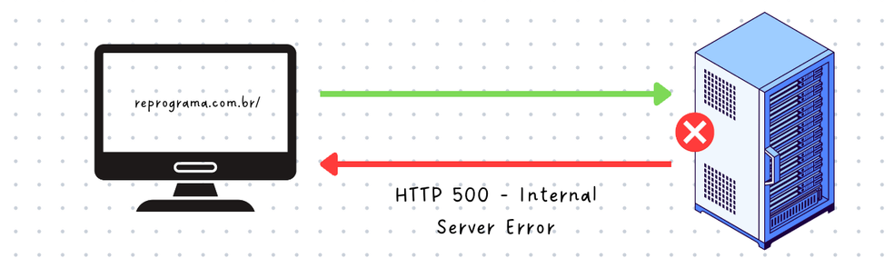

<h1 align="center">
  
</h1>

# Gestão de erros

Turma Online XX - Imersão JavaScript | Semana XX | 20XX | Professora Rayane Pimentel

### Objetivo

- Breve apresentação do conteúdo e dos objetivos da aula.
- Importância da gestão de erros e segurança em APIs.

### Resumo

O que veremos na aula de hoje?

- [Gestão de erros em APIs](#gestão-de-erros-em-apis)

  - [Introdução](#introdução)

- [Conteúdo](#conteúdo)

  - [Tipos de Erros em APIs](#tipos-de-erros-em-apis)

    - [Erros do cliente]()
    - [Erros do servidor]()
    - [Erros de validação]()

  - [Estratégias de Gestão de Erros]()

    - [Padrões de Resposta]()
    - [Middleware de Tratamento de Erro]()
    - [Log de Erros]()
    - [Monitoramento e Alertas]()
    - [Segurança na Gestão de Erros]()

  - [Segurança]()

    - [Autenticação e autorização]()
    - [Testes de Segurança]()

  - [Exercícios](#exercícios)
  - [Material da aula](#material-da-aula)
  - [Links Úteis](#links-úteis)

# Gestão de erros em APIs

## Introdução
Nessa aula iremos ver importância da gestão de erros em APIs e como ela impacta a experiência do usuário, manutenção do código e a segurança da aplicação.

## Conteúdo

### Tipos de Erros em APIs

#### Erros do cliente: 

Erros do lado do cliente ocorrem quando há problemas na requisição feita ao servidor, como requisições malformadas ou falta de autorização para acessar um recurso.

- **HTTP 400** (Bad Request): Indica que a requisição está malformada ou contém dados inválidos.
   - Exemplo: Um usuário envia uma requisição com uma URL contendo caracteres especiais que não são permitidos, ou um payload JSON inválido.

- **HTTP 404**: Ocorre quando o recurso solicitado não é encontrado no servidor.
    - "Erro 404: Pagina não encontrada" quando o usuário digita uma URL incorreta que não existe.

  

- **HTTP 403** (Forbidden):  Indica que o usuário não tem permissão para acessar o recurso solicitado, mesmo que esteja autenticado.
   - Exemplo: O servidor entende a requisição, mas o usuário não tem autorização para acessá-la, como tentar acessar uma página restrita.

  

#### Erros do Servidor:

Erros do lado do servidor acontecem quando há um problema ao processar a requisição do cliente. Geralmente, esses erros indicam falhas no código, no banco de dados ou no próprio servidor.

- **HTTP 500** (Internal Server Error): Indica que o servidor encontrou uma condição inesperada que o impediu de atender a requisição.
   - Exemplo: Ocorre quando há uma exceção não tratada no código, como uma falha ao conectar ao banco de dados.

- **HTTP 503** (Service Unavailable): Ocorre quando o servidor não está disponível para processar a requisição, geralmente por estar em manutenção ou sobrecarregado.
   - Exemplo: Um servidor de banco de dados está offline ou o serviço está temporariamente fora do ar.

- **HTTP 502** (Bad Gateway): Indica que um servidor, atuando como gateway ou proxy, recebeu uma resposta inválida de outro servidor ao tentar atender a requisição.
   - Exemplo: Um serviço intermediário como um load balancer não conseguiu se comunicar com o servidor de aplicação.

#### Erros de Validação:

Erros de validação ocorrem quando os dados enviados pelo cliente não atendem aos requisitos ou regras definidas pela aplicação.

- **HTTP 422** (Unprocessable Entity): Indica que o servidor entendeu a requisição, mas não conseguiu processá-la porque os dados fornecidos são semanticamente incorretos, mesmo que estejam tecnicamente bem formatados.

   

#### Benefícios

[CONTEUDO]

#### Abordagens

[CONTEUDO]

#### Implementação

[CONTEUDO]

## Outro Exemplo

#### ETCETC

[CONTEUDO]

---

### Exercícios

- [Exercicio para sala](/exercicios/para-sala/)
- [Exercicio para casa](/exercicios/para-casa/)

### Material da aula

- [Material](/material)

### Links Úteis

-

Desenvolvido com :purple_heart:  

